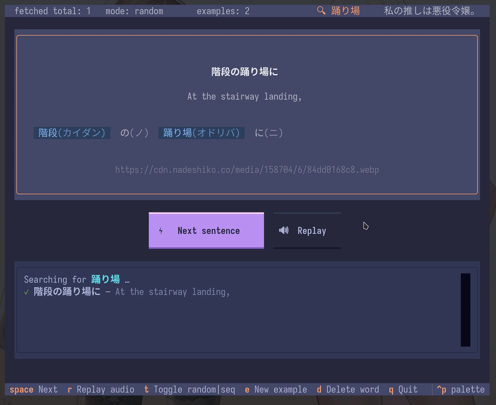

# Nadeshiko Anki Grind

Idea:

0. query grindable Anki cards based on a specific criteria (leeches, low ease,
   new cards, old cards, etc) OR just save some words to text file
1. export those cards from Anki via AnkiConnect to plain text
2. grind them using Nadeshiko examples, randomly or in sequence
3. copy current item in clipboard (external lookup?), allow to prune it from input file (seen too many times)
4. save history/session for further evaluation and LLM summary



## Binaries

TODO: upload to GitLab

By default app wil try to read `words.txt` from the current directory.
You can also drag and drop a `.txt` file onto the executable to use it.

## How to use

```bash
# specify Anki decks & fields in src/export.py:107,117 to grind
uv run src/export.py
# set key in .env or in the shell
export NADESHIKO_API_KEY=...
# grind via Nadeshiko api
uv run src/tui.py words.txt
```

## TODO:

    [x] key to .env
    [x] fix source name
    [x] images
    [x] basic stats
    [x] fetch different example for this item hotkey
    [x] find definition | copy to clipboard | etc, context
    [x] add option to remove current item from input file
    [x] clickable tokens
    [x] clickable image link
    [x] history shenanigans
    [x] build for Windows
    [x] drag and drop txt files
    [x] launch with 'words.txt' as default argument
    [x] basic GitLab page
    [x] add cool info
    [x] save chosen theme
    [x] debug setup with Textual (fix _log)
    [ ] tweak letter margin for JP text on Windows
    [x] record webm and normal, non-svg screenshot for docs and Gitlab page
    [ ] think how to distribute ~ single exe? zip? appimage?
    [ ] llm session export (create automatically, on quit, write to session.txt file)
    [x] Linux build and test
    [ ] include example txt data in build (?)
    [ ] semi-random mode ~> by frequency
    [-] open in YouGlish

## SUPER TODO:

Use history or stats to ignore (or vice versa, repeat) previously appeared
words. For example:

    1. skip a word if n (occurence) > 1 (in history)
    2. increase frequency of words with n (occurence) > 1 (in history)
