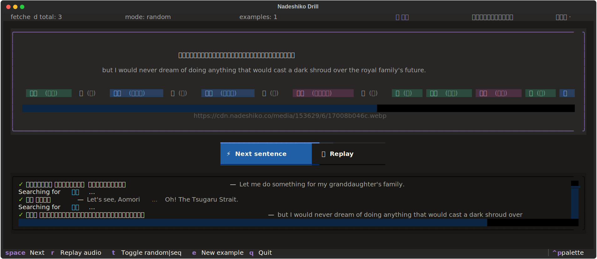

# Nadeshiko Anki Grind

Idea:

0. query grindable Anki cards based on a specific criteria (leeches, low ease,
   new cards, old cards, etc)
1. export those cards from Anki via AnkiConnect to plain text
2. grind them using Nadeshiko examples, randomly or in sequence
3. save history/session for further evaluation and LLM summary



```bash
# specify Anki decks & fields in src/export.py:107,117 to grind
uv run src/export.py
# set key in .env or in the shell
export NADESHIKO_API_KEY=...
# grind via Nadeshiko api
uv run src/tui.py words.txt
```

## TODO:

[x] key to .env
[x] fix source name
[x] images
[x] basic stats
[x] fetch different example for this item hotkey
[x] find definition | copy to clipboard | etc, context
[x] clickable tokens
[ ] clickable image link
[ ] add cool info
[ ] open in YouGlish
[ ] history shenanigans
[ ] llm session export

## SUPER TODO:

Use history or stats to ignore (or vice versa, repeat) previously appeared
words. For example:

1. skip a word if n (occurence) > 1 (in history)
2. increase frequency of words with n (occurence) > 1 (in history)
